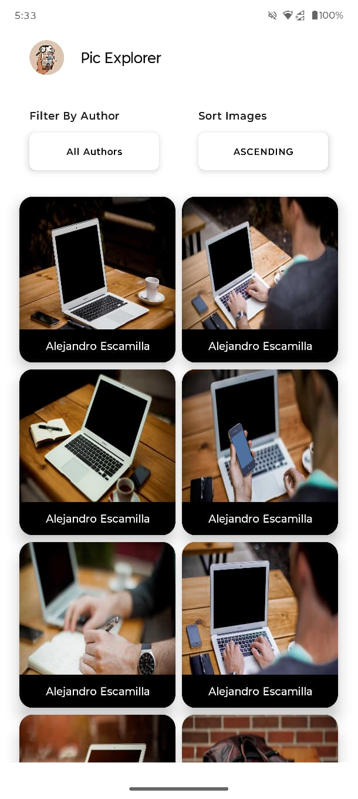
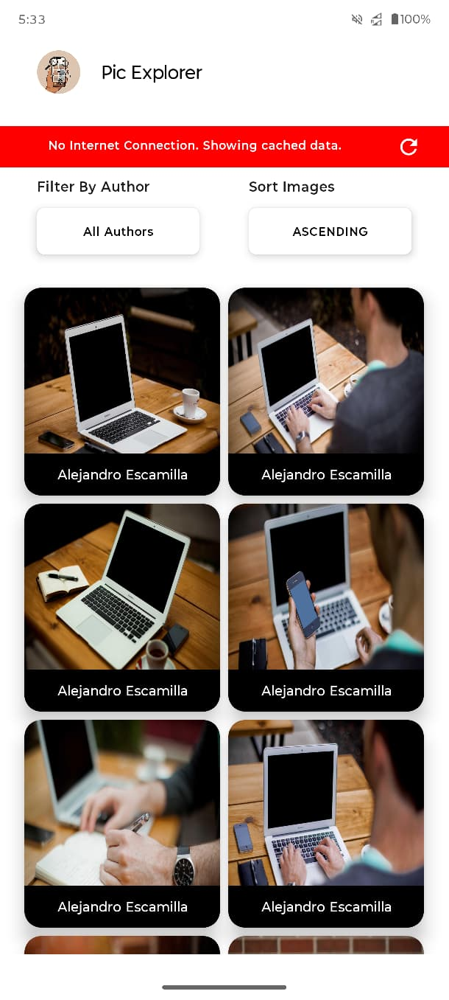

# Pic Explorer

**Pic Explorer** is an Android application built with **Jetpack Compose**, **Hilt**, **Retrofit**, and **Room**, designed to display images from an API with features like filtering, sorting, offline caching, and smooth user experience.

---

## Features

- Custom **App Icon**
- Display images in a **2-column grid** using Jetpack Compose.
- **Filter images by author**.
- **Remember** author even after closing
- **Sort images**.
- **Offline support**: Cached images display when no internet is available.
- **Offline banner** indicating network status when offline.
- **Refresh Button** on the ofline banner for retry.
- Error handling with **retry button**.
- **Unit Test Case** for repository.

---

## Architecture

The project follows **Clean Architecture**.

---

## Screenshots

|  |  |  |  |

---

## Technologies Used

- **Kotlin** & **Jetpack Compose**
- **Hilt** for dependency injection
- **Retrofit** for API requests
- **Room** for local caching
- **Glide** for image loading
- **SharedPreferences** for preferences
- **Flow** for data emmisions

